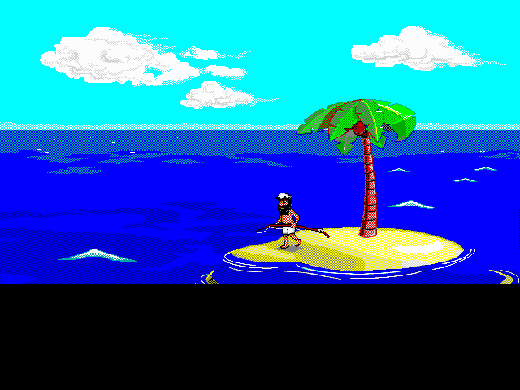
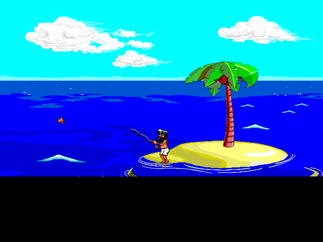

# Johnny Reborn

Johnny Reborn is a fork of [jno6809/jc_reborn](https://github.com/jno6809/jc_reborn), expanded into a multi-platform porting repo for the classic *Johnny Castaway* screen saver. This branch is the active `ps1` line, and the current work is focused on scene-by-scene PlayStation 1 validation.

<p align="center">
  
  
  
</p>

<p align="center">
  Current gallery: <code>FISHING 1</code> reference-capture frames from the validated PS1 scene-playback pipeline.
</p>

## Branch Snapshot

- Branch: `ps1`
- Current release: `v0.3.6-ps1`
- First fully working PS1 reference scene: `FISHING 1`
- Current acceptance bar: pixel-perfect visuals plus synced SFX across applicable variants
- Scene ledger: [docs/ps1/scene-status.md](docs/ps1/scene-status.md)
- Narrative status: [docs/ps1/current-status.md](docs/ps1/current-status.md)
- Testing and validation policy: [docs/ps1/TESTING.md](docs/ps1/TESTING.md)

`FISHING 1` is currently the only fully signed-off PS1 scene under the branch's modern bar. The rest of the branch is being promoted one scene at a time from that baseline.

## Current PS1 Method

The working PS1 path is a hybrid scene-playback pipeline:

- Host capture produces authoritative foreground pixels and sound events.
- PS1 replays those authored packs while owning the narrow runtime surface: background, waves, overlays, input, and SPU playback.
- Human visual and audible review is the primary certification gate.

If you want the current technical details, start here:

- [docs/ps1/current-status.md](docs/ps1/current-status.md)
- [docs/ps1/development-workflow.md](docs/ps1/development-workflow.md)
- [docs/ps1/scene-status.md](docs/ps1/scene-status.md)
- [docs/ps1/ps1-branch-cleanup-plan.yaml](docs/ps1/ps1-branch-cleanup-plan.yaml)

## Platform Work In This Repo

Finished ports:

- Low-memory and SDL1 systems
- Sega Dreamcast
- RetroFW-based devices
- InkPlate and microcontroller-based boards
- Bash and text-only systems

In progress:

- PlayStation 1
- Xbox
- Emscripten

Future targets:

- Nintendo Switch
- SerenityOS
- Oculus Go-era VR hardware
- DOS

If you want Johnny on a photo frame or embedded display, the InkPlate work is still one of the most practical paths in this repo.

## Original Data Files

To run Johnny Reborn you still need the original resource files:

- `RESOURCE.MAP`
- `RESOURCE.001`

Optional sound files can be taken from the [JCOS resources](https://github.com/nivs1978/Johnny-Castaway-Open-Source/tree/master/JCOS/Resources).

Expected layout:

| File name | Size (bytes) | md5 |
| --- | ---: | --- |
| RESOURCE.MAP | 1461 | 8bb6c99e9129806b5089a39d24228a36 |
| RESOURCE.001 | 1175645 | 374e6d05c5e0acd88fb5af748948c899 |
| sound0.wav | 10768 | 53695b0df262c2a8772f69b95fd89463 |
| sound1.wav | 11264 | 35d08fdf2b29fc784cbec78b1fe9a7f2 |
| sound2.wav | 1536 | f93710cc6f70633393423a8a152a2c85 |
| sound3.wav | 7680 | 05a08cd60579e3ebcf26d650a185df25 |
| sound4.wav | 5120 | be4dff1a2a8e0fc612993280df721e0d |
| sound5.wav | 3072 | 24deaef44c8b5bb84678978564818103 |
| sound6.wav | 15872 | eb1055b6cf3d6d7361e9a00e8b088036 |
| sound7.wav | 15360 | cab94bace3ef401238daded2e2acec34 |
| sound8.wav | 2560 | 39515446ceb703084d446bd3c64bfbb0 |
| sound9.wav | 3584 | f86d5ce3a43cbe56a8af996427d5c173 |
| sound10.wav | 20480 | 5b8535f625094aa491bf8e6246342c77 |
| sound12.wav | 5632 | 8c173a95da644082e573a0a67ee6d6a3 |
| sound14.wav | 11776 | e064634cfb9125889ce06314ca01a1ea |
| sound15.wav | 3072 | b3db873332dda51e925533c009352c90 |
| sound16.wav | 7680 | 2eabfe83958db0cad77a3a9492d65fe7 |
| sound17.wav | 4608 | 2497d51f0e1da6b000dae82090531008 |
| sound18.wav | 14336 | 994a5d06f9ff416215f1874bc330e769 |
| sound19.wav | 3584 | 5e9cb5a08f39cf555c9662d921a0fed7 |
| sound20.wav | 7680 | 80e7eb0e0c384a51e642e982446fcf1d |
| sound21.wav | 5120 | 1a3ab0c7cec89d7d1cd620abdd161d91 |
| sound22.wav | 1536 | a0f4179f4877cf49122cd87ac7908a1e |
| sound23.wav | 2048 | 52fc04e523af3b28c4c6758cdbcafb84 |
| sound24.wav | 9728 | 5a6696cda2a07969522ac62db3e66757 |

All of these files should live alongside the `jc_reborn` executable, or in the repo's expected resource layout for branch-specific tooling.

## Running

Desktop / host exploration:

```bash
./jc_reborn help
```

Current PS1 branch loop:

```bash
./scripts/rebuild-and-let-run.sh fgpilot fishing1
```

That command is the active bring-up path for the validated scene-playback workflow. For scene-by-scene iteration and variant handling, use [docs/ps1/development-workflow.md](docs/ps1/development-workflow.md).

## Testing

General tests:

```bash
cd tests
make
```

Useful entry points:

- [tests/VISUAL_TESTING.md](tests/VISUAL_TESTING.md)
- [docs/ps1/TESTING.md](docs/ps1/TESTING.md)
- [docs/ps1/scene-status.md](docs/ps1/scene-status.md)

The old PS1 regtest and harness-heavy eras are still valuable for archaeology and targeted debugging, but they are no longer the branch's primary truth surface. Current PS1 signoff is scene-by-scene human review.

## Project Background

The original `jc_reborn` work already decoded a large part of the Johnny Castaway engine. This repo pushes further into platform-specific ports, constrained hardware, and branch-specific workflows.

What this repo adds on top of the original line is not just feature work. It is a long-running porting and validation effort across very different targets, with each branch evolving its own tools and methodology.

## Thanks

Johnny Reborn would not exist without the work and research of the people below.

- Hans Milling (`nivs1978`), author of JCOS: https://github.com/nivs1978/Johnny-Castaway-Open-Source
- Alexandre Fontoura (`xesf`), author of Castaway: https://github.com/xesf/castaway
- Sierra Chest's Johnny Castaway archive: http://sierrachest.com/index.php?a=games&id=255&title=johnny-castaway
- Jeff Tunnel
- Kevin and Liam Ryan
- Jaap
- Gregori
- Guido
